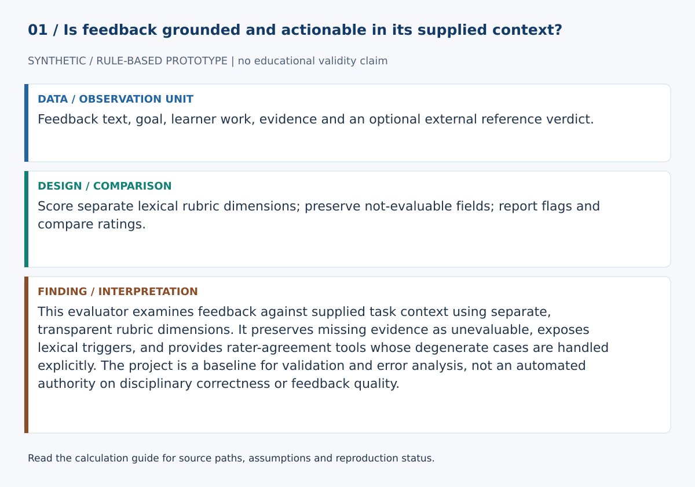
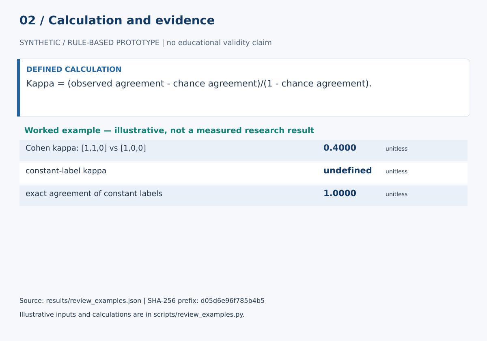

# Feedback Quality Evaluator

This evaluator examines feedback against supplied task context using separate, transparent rubric dimensions. It preserves missing evidence as unevaluable, exposes lexical triggers, and provides rater-agreement tools whose degenerate cases are handled explicitly. The project is a baseline for validation and error analysis, not an automated authority on disciplinary correctness or feedback quality.

## Start here

- [Calculations, evidence and verification scope](CALCULATIONS.md)
- [Figure sources and exact numerical paths](docs/figure_spec.json)
- [Data status](data/README.md)





**Review scope:** 41 existing unittest checks passed. The bundled demonstration executed successfully in this review.

## Detailed project documentation

> Context-aware formative-feedback evaluation with separate rubric dimensions, explicit evidence boundaries, error flags, revision suggestions, and human-rater validation tools.

[](https://github.com/devissaputra/feedback_quality_evaluator/actions/workflows/ci.yml)


**Area:** AI in Education · Formative Feedback · Instructional Design  
**Status:** working research prototype  
**Author:** Devis Saputra

## Why this project exists

Feedback can sound polished and still be wrong, vague, irrelevant, overly directive, or impossible to act on.

A useful evaluator therefore needs more than:

- word count
- action-verb detection
- the word `because`
- confident wording
- one overall score

This repository evaluates feedback against supplied learning context and keeps distinct dimensions separate.

The current implementation is a transparent heuristic baseline for research and error analysis.

It is **not** a validated automated judge of feedback quality.

## Core design principle

**Context controls what the evaluator is allowed to claim.**


The main API receives a structured `FeedbackContext` containing:

- feedback text
- task goal
- rubric criterion
- learner work
- identified issue
- supporting evidence
- expected standard
- external reference verdict

Missing context can make a dimension:

```text
not_evaluable
```

rather than forcing a fabricated score.

## What changed from the original prototype

The original version used:

- action-verb presence
- unique-word count as a specificity proxy
- `references_error=True/False`
- words such as `because` as evidence cues
- a 0–4 composite score

Those rules could reward long vague feedback and penalize short precise feedback.

The rebuilt version removes those assumptions from the main research API.

For example, this concise feedback can now be recognized as grounded:

> Replace “causes” with “is associated with”; the dataset is observational.

A long comment no longer gains specificity simply by containing more unique words.

## Multidimensional evaluation

`evaluate_feedback()` returns eight separate dimensions.

### 1. Goal alignment

Does the feedback visibly connect to the supplied:

- task goal
- rubric criterion
- expected standard

The current baseline uses transparent lexical overlap.

It does not claim semantic entailment.

### 2. Grounding and specificity

Does the feedback refer to concrete details in:

- learner work
- identified issue
- supporting evidence

Specificity is therefore grounded in context rather than message length.

### 3. Actionability

Does the feedback give the learner an explicit action?

Does that action connect to the supplied task/work context?

### 4. Explanatory rationale

Does the feedback provide a reason?

Is the reason actually connected to supplied work or evidence?

The word `because` alone is not enough for the highest score.

### 5. Feed-forward

Does the feedback explain what to do next and, ideally, how to:

- check
- verify
- test
- sequence

the next step?

### 6. Constructive framing

Does the wording remain task- or process-focused rather than judging the learner as a person?

This is a limited lexical diagnostic, not a full sentiment or discourse model.

### 7. Learner agency

Does the wording leave room for learner choice or exploration?

The baseline distinguishes some agency-supportive language from clearly coercive wording.

### 8. Reference alignment

This dimension is intentionally different from the others.

The software **does not infer correctness** from the feedback text.

Reference alignment is evaluated only when an external verdict is supplied:

- `supports`
- `contradicts`
- `insufficient`
- `not_provided`

When evidence is absent or insufficient, reference alignment is `not_evaluable`.

## No default quality total

The main API intentionally returns:

```python
overall_score = None
```

because a single number can hide important failures.

Feedback can be:

- actionable but wrong
- correct but non-actionable
- specific but coercive
- constructive but unrelated to the rubric
- well explained but unsupported by reference evidence

Any future composite score should require an explicit and empirically justified weighting model.

## Error taxonomy

The evaluator can flag transparent review cases such as:

- `generic_praise`
- `person_focused_judgment`
- `vague_criticism`
- `missing_action`
- `missing_next_step`
- `weak_grounding`
- `goal_or_rubric_mismatch`
- `rationale_without_grounding`
- `certainty_without_reference`
- `reference_contradiction`
- `limited_context`

These are review signals, not final quality judgments.

## Revision suggestions

`revision_suggestions()` converts flags into targeted improvement prompts such as:

- point to the specific claim or step
- connect the feedback to the rubric criterion
- add a feasible next action
- explain how the learner can verify the next step
- reduce unsupported certainty
- recheck a feedback claim against reference evidence

The repository does not automatically rewrite feedback in the current baseline.

## Synthetic stress-test corpus


The repository includes **20 synthetic contextual feedback cases** designed to test failure modes.

Examples include:

- short precise feedback
- verbose vague feedback
- generic praise
- vague criticism
- person-focused judgment
- unsupported certainty
- rubric mismatch
- rationale words without grounding
- correct information with no next action
- actionable advice contradicted by reference evidence
- agency-supportive wording
- missing context
- strong feed-forward feedback

These are test fixtures, not empirical research results.

## Synthetic human ratings

`data/ratings.csv` contains two fictional rater profiles for seven ordinal rubric dimensions.

The demo uses those synthetic ratings to exercise:

- exact agreement
- weighted Cohen kappa
- heuristic-versus-human comparison
- mean absolute error

The resulting numbers are **not real inter-rater reliability results**.

## Human-rater validation tools

### Cohen kappa

`cohen_kappa(...)`

Provides unweighted Cohen kappa for two rating sequences.

### Weighted Cohen kappa

`weighted_cohen_kappa(...)`

Supports:

- linear weights
- quadratic weights

for integer ordinal ratings.

### Dimension validation

`dimension_validation(...)`

Reports:

- sample size
- exact agreement
- mean absolute error
- linear weighted kappa
- quadratic weighted kappa

### Pairwise rater summary

`pairwise_rater_summary(...)`

Produces pairwise agreement summaries when several rater sequences are supplied.

This is **not** a formal multi-rater reliability coefficient.

## Run the project

```bash
git clone https://github.com/devissaputra/feedback_quality_evaluator.git
cd feedback_quality_evaluator

python scripts/run_demo.py
python -m unittest discover -s tests -v
```

The current implementation uses only the Python standard library.

## Core API

`FeedbackContext`  
Structured task, learner-work, evidence, and feedback context.

`evaluate_feedback(...)`  
Returns separate dimension records, error flags, and revision suggestions.

`feedback_flags(...)`  
Returns transparent review flags.

`revision_suggestions(...)`  
Returns targeted suggestions based on detected limitations.

`cohen_kappa(...)`  
Unweighted two-rater agreement.

`weighted_cohen_kappa(...)`  
Ordinal weighted two-rater agreement.

`exact_agreement(...)`  
Simple exact-match fraction.

`mean_absolute_error(...)`  
Average ordinal-distance error.

`dimension_validation(...)`  
Compares automated dimension scores with human ordinal ratings.

`pairwise_rater_summary(...)`  
Pairwise comparison across multiple rater sequences.

`score_feedback(...)`  
Backward-compatible legacy wrapper. New research should use `evaluate_feedback()`.

## Data

`data/sample.csv`  
Twenty synthetic contextual feedback examples.

`data/ratings.csv`  
Two synthetic human-rater profiles.

`data/README.md`  
Schema, reference-evidence rules, stress cases, and real-data governance requirements.

## Research grounding

The design is informed by established formative-feedback research.

### Hattie & Timperley

Their feedback framework emphasizes information about:

- the learning goal
- current performance/progress
- what happens next

Reference:

- Hattie, J., & Timperley, H. (2007)
- *The Power of Feedback*
- https://doi.org/10.3102/003465430298487

### Shute

Shute's review emphasizes formative feedback that is supportive, specific, credible, and useful for improving learning.

- Shute, V. J. (2008)
- *Focus on Formative Feedback*
- https://doi.org/10.3102/0034654307313795

### Nicol & Macfarlane-Dick

Their work connects good feedback practice with learner self-regulation.

- Nicol, D. J., & Macfarlane-Dick, D. (2006)
- https://doi.org/10.1080/03075070600572090

### Carless & Boud

Their feedback-literacy framework emphasizes learners' capacity to understand and use feedback.

- Carless, D., & Boud, D. (2018)
- https://doi.org/10.1080/02602938.2018.1463354

See `docs/related_work.md` for the scope boundary.

## Evaluation checklist


A real empirical study should investigate:

1. **Construct validity** — do dimensions represent meaningful feedback properties?
2. **Reference validity** — is the answer key or expert reference itself trustworthy?
3. **Rater reliability** — do trained raters apply the dimensions consistently?
4. **Adversarial robustness** — can verbose, vague, or confidently wrong feedback fool the heuristic?
5. **Cross-context validity** — does the approach generalize across disciplines, tasks, languages, and feedback sources?
6. **Learner uptake** — can learners understand and use the feedback to improve later work?

## Responsible-use boundary

The evaluator must not treat:

- length as specificity
- confidence as correctness
- politeness as effectiveness
- `because` as proof of explanation
- action verbs as proof of appropriate advice
- rubric keywords as proof of genuine alignment

Reference correctness is never inferred from fluent text.

## What the system intentionally does not do

The repository does not currently implement:

- LLM judging
- embeddings
- semantic entailment
- automated factual verification
- disciplinary knowledge bases
- automated rubric extraction
- full tone analysis
- multilingual validation
- feedback timing optimization
- learner uptake prediction
- causal feedback-effect estimation
- validated multi-rater reliability coefficient
- validated overall quality score

Those boundaries are deliberate.

## Limitations

The current baseline:

- uses lexical overlap rather than semantic reasoning
- uses hand-authored cue lexicons
- is English-oriented
- cannot judge domain correctness without external evidence
- cannot evaluate feedback timing from text
- cannot measure actual learner uptake
- cannot establish learning effectiveness
- does not quantify heuristic uncertainty statistically
- does not validate the dimension definitions empirically

## Repository map

```text
.
├── .github/workflows/ci.yml
├── assets/
│   ├── architecture.svg
│   ├── data_flow.svg
│   ├── demo_snapshot.svg
│   └── evaluation_dashboard.svg
├── data/
│   ├── README.md
│   ├── ratings.csv
│   └── sample.csv
├── docs/
│   ├── ethics_and_risks.md
│   ├── related_work.md
│   └── research_protocol.md
├── reports/model_card.md
├── scripts/run_demo.py
├── src/feedback_quality_evaluator/
│   ├── __init__.py
│   └── core.py
├── tests/test_core.py
├── .gitignore
├── CITATION.cff
├── LICENSE
├── pyproject.toml
├── requirements.txt
└── README.md
```

## Research path

A stronger empirical version would:

1. finalize dimension definitions with expert review
2. build a larger feedback corpus across tasks and disciplines
3. train at least two raters using anchor examples
4. report dimension-level rater agreement before adjudication
5. adjudicate disagreements into a reference set
6. test lexical heuristics against adversarial examples
7. compare transparent heuristics with stronger models
8. preserve not-evaluable states where evidence is missing
9. test multilingual and cross-disciplinary generalization
10. measure learner uptake and revision quality separately
11. only add a composite score if weighting is theoretically and empirically justified
12. use an appropriate causal design before claiming that higher evaluator scores improve learning

## Citation and license

`CITATION.cff` contains the software citation.

Code and original SVG visuals use the MIT License. External datasets, rubrics, and publications retain their own licenses and usage conditions.
