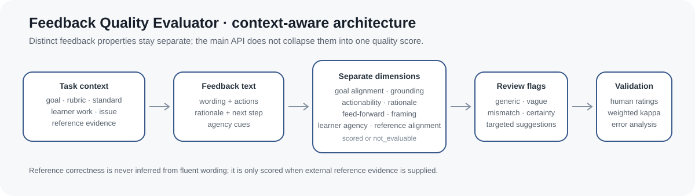
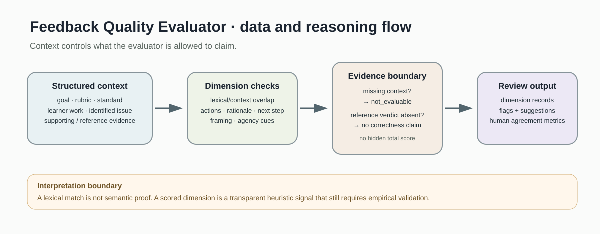
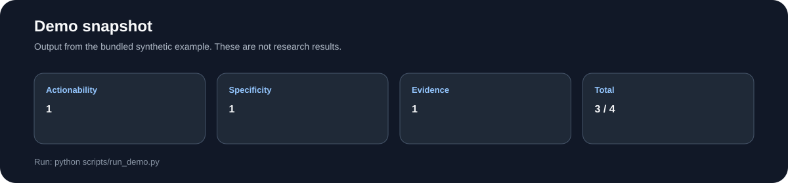
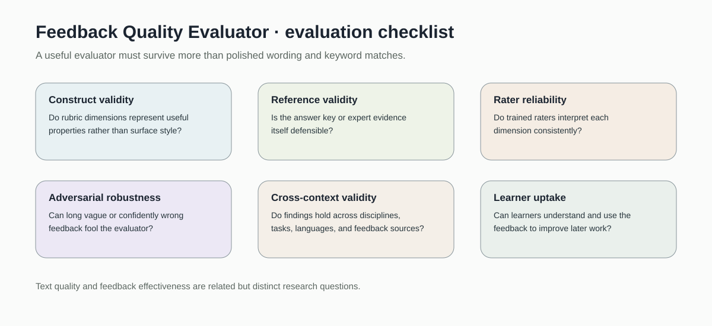

# Feedback Quality Evaluator

> Heuristic evaluator for formative feedback specificity, actionability, explanatory evidence, and rater agreement.

[](https://github.com/devissaputra/feedback-quality-evaluator/actions/workflows/ci.yml)



**Area:** Adaptive Instruction & Feedback    
**Status:** working research prototype  
**Author:** Devis Wawan Saputra

## What this project is for

Not all feedback that sounds polished is useful. This project scores formative feedback on concrete qualities such as actionability, specificity, and whether the explanation is supported, then leaves room for comparison with human ratings.

**Who may find it useful:** Researchers evaluating AI feedback and instructional designers building feedback rubrics.

## Research questions

1. Which measurable properties distinguish useful formative feedback from generic comments?
2. How reliable are automated rubric scores against human ratings?
3. Where do AI feedback systems overstate correctness or actionability?

## How it works

The baseline scores a feedback message with three visible rules: whether it contains an action, whether it is specific enough under the chosen heuristic, and whether it includes explanatory evidence. Cohen kappa is provided separately for comparing two human rating sequences.



Draft feedback is converted into dimension scores before any overall total is calculated. Human ratings remain a separate source of evidence rather than being hidden inside the heuristic.



This snapshot shows the bundled synthetic example for Feedback Quality Evaluator. It checks the software path; it is not an empirical performance result.

## Methods in the current baseline

- action verb detection
- specificity heuristic
- evidence cue detection
- transparent composite score
- Cohen kappa

## Data

Synthetic feedback examples and ratings are included; real student work should be de-identified before use.

`data/README.md` documents the sample schema and the conditions that should be recorded before any real dataset is connected. Restricted or identifiable learner data should stay outside the repository.

## Run the demo

```bash
git clone https://github.com/devissaputra/feedback-quality-evaluator.git
cd feedback-quality-evaluator
python scripts/run_demo.py
python -m unittest discover -s tests -v
```

The demo scores one short formative feedback message and prints each component. The maximum total is four because specificity contributes up to two points.

## What to evaluate next

A proper study needs a rubric, multiple trained raters, a diverse feedback set, and analysis of where the heuristic agrees or disagrees with human judgments. A learned model should only be added after that reference set exists.

## Evaluation view



The Feedback Quality Evaluator dashboard is an evaluation checklist rather than a result chart. The bars are illustrative only; the labels show the evidence a real study would need to collect.

## Limits and responsible use

The score is a transparent heuristic, not a validated measure of feedback quality. It cannot judge disciplinary accuracy, tone, timing, or whether a learner actually uses the feedback. See `docs/ethics_and_risks.md` for the broader risk review.

## Repository map

```text
.
├── .github/workflows/ci.yml
├── assets/
│   ├── architecture.svg
│   ├── data_flow.svg
│   ├── demo_snapshot.svg
│   └── evaluation_dashboard.svg
├── data/
│   ├── README.md
│   └── sample.csv
├── docs/
│   ├── ethics_and_risks.md
│   ├── related_work.md
│   └── research_protocol.md
├── reports/model_card.md
├── scripts/run_demo.py
├── src/feedback_quality_evaluator/core.py
├── tests/test_core.py
├── CITATION.cff
├── LICENSE
├── pyproject.toml
└── README.md
```

## Research path

A credible next version would:

1. build and double rate a feedback corpus
2. report inter rater agreement by rubric dimension
3. compare the heuristic with a learned model and qualitative error analysis

## Related work

`docs/related_work.md` points to open projects that are relevant to this problem area. They are context for comparison and study design; this repository does not present their code as its own.

## Citation and license

`CITATION.cff` contains the software citation. The code and original SVG visuals use the MIT License. Any external dataset keeps its own license and usage conditions.
